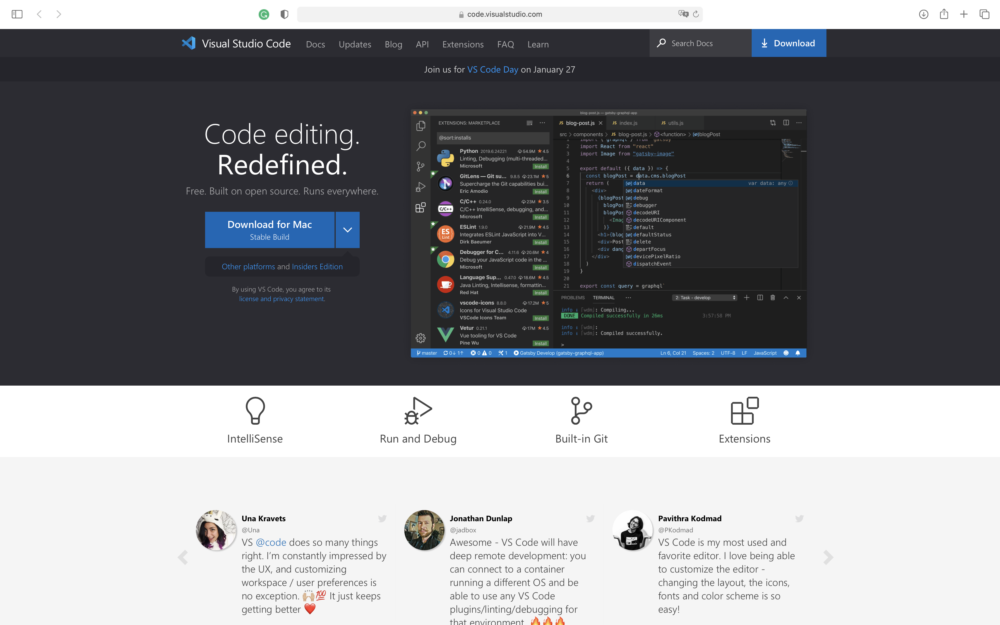
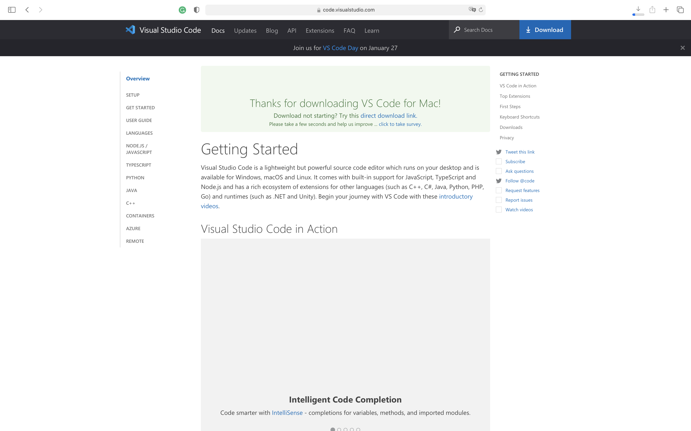

# 1.3\(B\) MACOS下安装VSCode

本节课我们会在MACOS下安装VSCode。

首先，打开VSCode官网：



随后，点击屏幕上方蓝色长放心“Download for Mac”字样，开始下载VSCode

接下来，你会看到下载成功页面，请在这个页面保持等待，直到下载成功。

随后，解压下载下来的文件，这时候你会得到一个文件名为“Visual Studio Code.app” 复制这个文件，不要打开它。

随后打开你的访达，选择“应用程序”将这个文粘贴到该目录下。

接下来，你就可以在你软件列表（启动台）中找到VSCode，接下来，双击打开这个软件。你有可能会得到以下页面。点击打开即可。

现在，你成功地在你的MAC上安装了VSCode。

